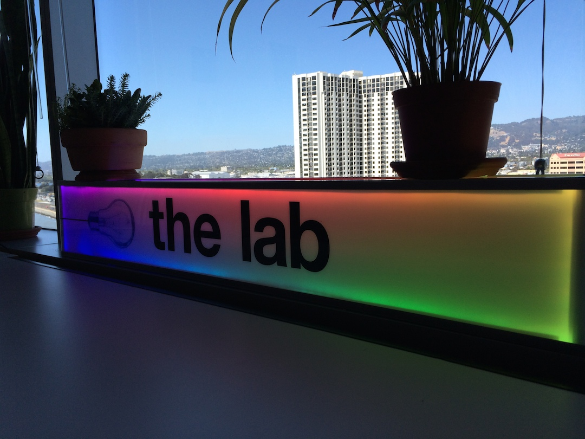

Art.com Labs LED Sign
==========

This is a slightly modifed version of strandtest.ino from AdaFruit:  https://github.com/adafruit/Adafruit_NeoPixel/blob/master/examples/strandtest/strandtest.ino
 
## Requirements
1. An [Arduino](http://www.arduino.cc) Board.
2. [AdaFruit NeoPixel](http://www.adafruit.com/products/1138)
3. [Adafruit NeoPixel library](https://github.com/adafruit/Adafruit_NeoPixel)

## Instructions
1. Install [Adafruit NeoPixel library](https://github.com/adafruit/Adafruit_NeoPixel)
2. Connect the NeoPixel to ground and power.  Power requirements here: [AdaFruit NeoPixel](http://www.adafruit.com/products/1138) 
3. Connect NeoPixel to PIN 3 of the Arduino.  Connect NeoPixel ground to the ground of the Arduino.
4. Upload labledsign.ino to the board and run it.

